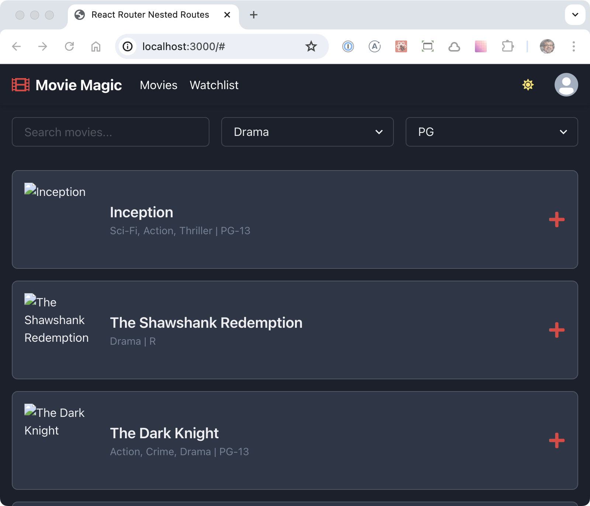

# Movie Magic Devin Chakra UI

A movie streaming app generated by [Devin](https://devin.ai) (a generative UI
tool to creating user interfaces).

I started with the raw implementation generated by Devin. Then, I refined and
enhanced the code through a series of manual adjustments to align it with my
coding standards. Each modification has been thoroughly documented in the commit
history below.

## Tech Stack

1. Framework: React 18 + Vite + React Router
2. Styling: Chakra UI
3. Linting: Code Shaper ESLint configuration

## Prompt used for app generation

Write a movie streaming application called "Movie Magic".

The application should support light and dark mode, with dark mode as the
default.

The theme of the application should be red, This means that when you need to use
accent colors for buttons etc., use red.

The application should consists of the following components from top to bottom.

1. Application header: 56 pixels tall, divided into left and right sections.
   Left section consists of following components from left to right: Logo (a
   film icon), application name ("Movie Magic"), navigation menu with 2 links
   ("Movies" & "Watchlist"). The right section consists of 2 components that are
   right justified, and they are (from left to right): (a) light/dark mode
   toggle, (b) user's avatar.
2. Movie filters: Three movie filters all in one row: (a) Search input, (b)
   "Categories" dropdown, (c) "Certification" dropdown
3. Movie List: 1 movie per row. Each row contains the movie image, name and a
   plus icon to add the movie to the watchlist

There is no need to implement authentication.

Use mock data for movies.

## Commits

### commit-1

Initial commit with my starter app.


### commit-2

Added 4 files generated by Devin:

1. routes/home.tsx
2. components/Filters.tsx
3. components/Header.tsx
4. components/MovieList.tsx

Note: Nice job breaking up the home page into 3 components as instructed in the
prompt. Here's the resulting page.



## Development Build

```shell
npm ci
npm run dev
```

Now point your browser to http://localhost:3000
